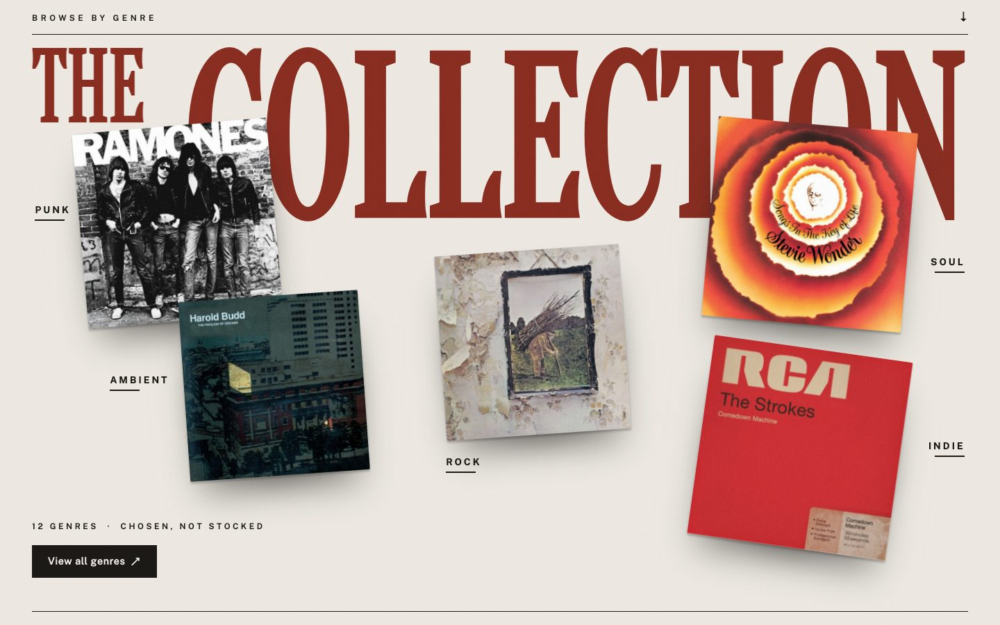
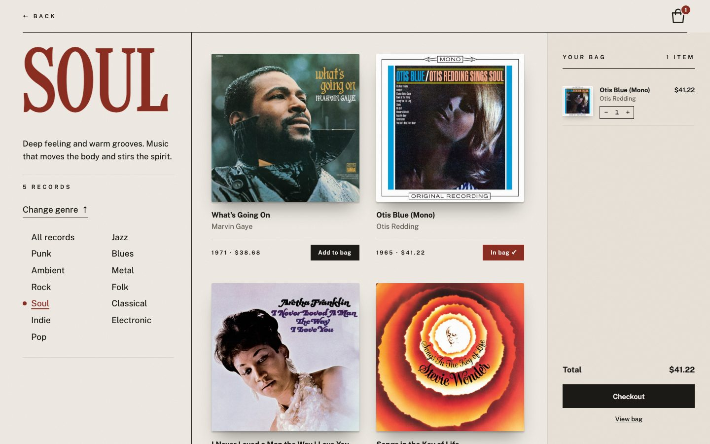
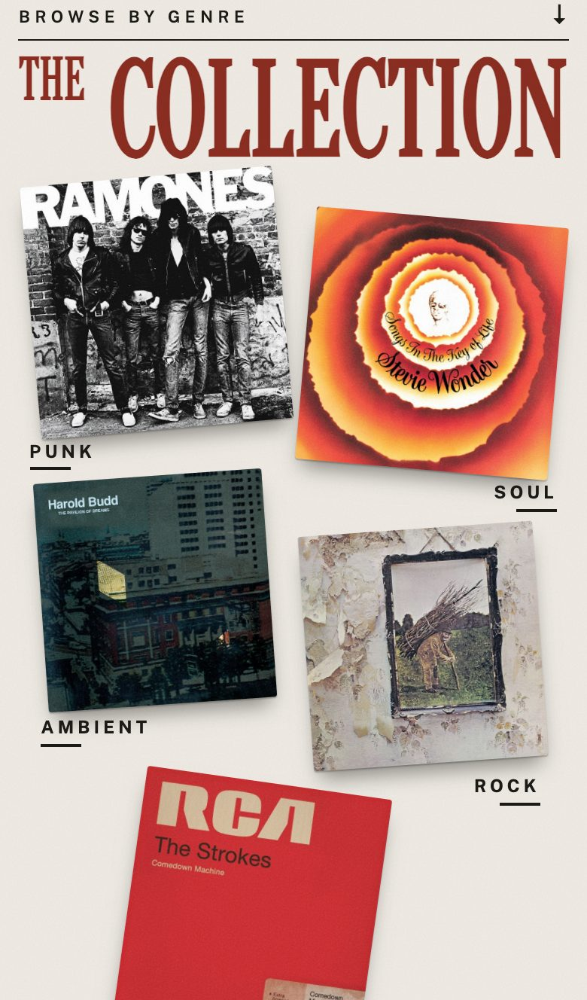

# Spiral Sounds

A full-stack vinyl record store — Node.js, Express and vanilla JavaScript, with session auth, Stripe checkout, stock that holds up under retries and races, and an editorial front end designed from scratch.

**[Live demo](https://spiral-sounds-8dk9.onrender.com)** · hosted on Render's free tier, so the first visit after a quiet spell can take ~30 s to wake up.


---

## What it does

- **Browse** 60 real records across 12 genres, from a hand-laid genre collage or a genre/search overlay
- **Search** by title, artist or genre, including subgenres ("new wave" still finds the right records)
- **Play** the hero turntable — press the silver dial and a preview plays while the label spins
- **Buy** — bag with quantities, Stripe Payment Element checkout, stock taken exactly once per order
- **Accounts** — sign up / log in with session cookies; the bag and checkout require an account

| | |
|---|---|
|  |  |
|  |  |

<p>
  
  
  
</p>

---

## Design

The site was redesigned in September 2026: static HTML mockups first ([`design/mockups/`](design/mockups/)), iterated page by page, then rebuilt into the app.

- **System** — cream paper with a fine grain, one red for display type and the closing poster, a condensed Didone (Oranienbaum) for headlines, Public Sans for everything else, and a spiral mark used for the logo, favicon and record labels
- **Motion with a job** — the turntable's label is the only part of the record that turns (the grooves' baked-in highlights stay still, as reflections would on a real deck); the genre overlay grows out of the sleeve you clicked; covers morph into the detail page with cross-document View Transitions
- **Responsive** — one 760 px breakpoint re-lays every page for phones rather than shrinking it

---

## Tech stack

**Frontend:** vanilla JS (ES modules), HTML, CSS (no framework), Web Animations API, View Transitions, Stripe.js

**Backend:** Node.js, Express, express-session, bcryptjs, Stripe Node SDK

**Database:** Supabase PostgreSQL

**Testing:** Vitest + Supertest (unit and integration), Playwright (end-to-end)

**Hosting / CI:** Render (auto-deploy from `main`), GitHub Actions

---

## Architecture

```
├── app.js                   # Express app — middleware, session, routes (no listen, so tests can import it)
├── server.js                # Starts the HTTP server
├── db/db.js                 # pg adapter: SQLite-style get/all/run, plus transaction(fn)
├── routes/                  # auth, me, products, cart, payments, orders
├── controllers/
│   ├── productsController.js   # search (ILIKE + subgenre map), genre filter
│   ├── cartController.js       # add (stock-checked), quantity, remove
│   ├── paymentsController.js   # PaymentIntent creation, server-side amount + stock checks
│   ├── ordersController.js     # order completion: verify with Stripe, take stock, refund on sell-out
│   └── authController.js / meController.js
├── middleware/requireAuth.js
├── scripts/                 # catalog import (iTunes Search API), orders table migration
├── design/mockups/          # the design reference
└── public/
    ├── css/                 # site.css (shared) + one file per page
    ├── js/                  # one module per page + shared header, cart API, stepper
    └── *.html               # index, detail, cart, login, signup
```

### Key decisions

- **Payments never trust the client.** The server recomputes the bag total before creating a PaymentIntent and records what's being bought in the intent's metadata.
- **Completing an order is server-side and idempotent.** After Stripe confirms a payment, `POST /api/orders/complete` retrieves the PaymentIntent from Stripe, then in one transaction records the order, decrements stock and clears the bag.
  - `orders.payment_intent_id` is `UNIQUE`, so a retry, refresh or simultaneous duplicate returns the same order and stock is taken once
  - each decrement is a single conditional `UPDATE … SET stock = stock - n WHERE stock >= n`, so two buyers of the last copy can't both succeed
  - if a record sold out while someone was paying, the transaction rolls back and the payment is refunded in full
- **Stock is enforced before money moves too** — adding to the bag, changing a quantity and creating a PaymentIntent all reject more copies than the shelf holds.
- **Auth** — HTTP-only session cookies, bcrypt hashes, one `requireAuth` middleware on every cart, payment and order route.
- **Search** — server-side `ILIKE` across title, artist and genre; a `SUBGENRE_MAP` widens subgenre searches to their parent genre.
- **Database adapter** — `db.js` wraps `pg.Pool` with the SQLite-style interface the app started with (placeholder conversion, `RETURNING id`), and adds `transaction(fn)` on a single checked-out client.

---

## Getting started

**Prerequisites:** Node.js 18+, a [Supabase](https://supabase.com) PostgreSQL database, a [Stripe](https://stripe.com) account (test mode).

```bash
git clone https://github.com/CodeCary80/Spiral-Sounds.git
cd Spiral-Sounds
npm install
```

Create `.env` in the project root:

```env
DATABASE_URL=your_supabase_connection_string
STRIPE_SECRET_KEY=sk_test_...
SPIRAL_SESSION_SECRET=your_session_secret
```

Create the orders tables (additive and safe to re-run), then start the server:

```bash
node scripts/createOrders.js
npm start
```

Open `http://localhost:8000`. To pay, use Stripe's test card `4242 4242 4242 4242`, any future expiry and any CVC.

---

## Testing

```bash
npm test            # Vitest: 32 unit + integration tests
npm run test:e2e    # Playwright: 5 specs in chromium, firefox and webkit
```

| File | Covers |
|---|---|
| `public/js/cartTotal.test.js` | Cart total math |
| `controllers/paymentsController.test.js` | Payment amount validation and server-side total matching |
| `app.test.js` | Protected routes return `401` without a session |
| `controllers/cartController.test.js` | Emptying a bag |
| `controllers/cartQuantity.test.js` | Setting quantities: invalid values, the stock cap, another user's line |
| `controllers/ordersController.test.js` | Order completion against Stripe test mode: unpaid and foreign payments, a doubled + retried completion, a mid-payment sell-out refund, two buyers for one copy |
| `e2e/*.spec.ts` | Home title, add-to-bag logged out / in, empty bag, search with no results |

There is no separate test database, so the integration and end-to-end tests run against the live Supabase instance. Every test that writes data uses its own throwaway account (and, for orders, its own temporary record) and deletes it afterwards.

---

## CI/CD

- **CI** — GitHub Actions checks the server on every push and runs the Playwright suite on pull requests into `main` (`DATABASE_URL` and `STRIPE_SECRET_KEY` are repository secrets)
- **CD** — Render deploys every push to `main`

---

## Notes

- Record metadata and cover art come from the iTunes Search API; covers belong to their respective labels and artists and are used here for a non-commercial portfolio project.
- The Client Stories portraits and interviews are illustrative, not real customers.
- Payments run in Stripe test mode.
